```{r setup, include=FALSE}
options(width=60)
```

Wrangling Data
===

## Agenda
- Data Import

- Tidying Data

- Manipulating Data

## Data Import

The tidyverse includes a number of easy-to-use packages for importing data:

>- `readr` for text files (including .csv and .tsv files)

>- `readxl` for Excel files

>- `haven` for Stata, SPSS, and SAS files

>- and of course base-R `load()` loads .RData/.rda files


## Data Import

The tidyverse includes a number of easy-to-use packages for importing data:

- `readr` for text files (including .csv and .tsv files)

- `readxl` for Excel files

- `haven` for Stata, SPSS, and SAS files

- and of course base-R `load()` loads .RData/.rda files

#### The `rio` package provides a one-size-fits-all shortcut: `import()`

## Data Access

Getting data into `R` requires us to have data.

- For our own survey or experiment, we can just publish the data 

- For others' data, though, we should provide replicable access

## Data Access with a Static Direct Link

If there's a static link directly to the file you need, such as this income inequality data from the Australian Bureau of Statistics, automating the download is straightforward

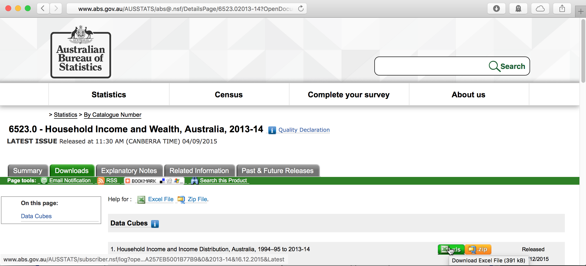

## Data Access with a Static Direct Link

<!-- eval=FALSE b/c link is too long to fit on line and the split one doesn't run -->

```{r, eval=FALSE}
abs_link <- "http://www.abs.gov.au/AUSSTATS/subscriber.nsf/
    log?openagent&6523DO00001_201314.xls&6523.0&Data%20Cubes&
    4F00682720AFA825CA257EB5001B77B9&0&2013-14&16.12.2015&Latest"
download.file(url = abs_link, destfile = "cmcr04_files/abs.xls")
```

## Data Access with a Static Direct Link
<!-- eval=FALSE b/c link is too long to fit on line and the split one doesn't run -->

```{r, eval=FALSE}
abs_link <- "http://www.abs.gov.au/AUSSTATS/subscriber.nsf/
log?openagent&6523DO00001_201314.xls&6523.0&Data%20Cubes&
4F00682720AFA825CA257EB5001B77B9&0&2013-14&16.12.2015&Latest"
download.file(url = abs_link, destfile = "cmcr04_files/abs.xls")
```

It can be a good idea to make downloads conditional:

```{r, eval=FALSE}
if (!file.exists("cmcr04_files/abs.xls")) {
    abs_link <- "http://www.abs.gov.au/AUSSTATS/subscriber.nsf/
    log?openagent&6523DO00001_201314.xls&6523.0&Data%20Cubes&
    4F00682720AFA825CA257EB5001B77B9&0&2013-14&16.12.2015&Latest"
    download.file(url = abs_link, destfile = "cmcr04_files/abs.xls")
}
```

<!-- eval=TRUE to actually run this next chunk but echo=FALSE b/c link is too long to fit on one line -->

```{r, echo=FALSE, eval=TRUE}
if (!file.exists("cmcr04_files/abs.xls")) {
    abs_link <- "http://www.abs.gov.au/AUSSTATS/subscriber.nsf/log?openagent&6523DO00001_201314.xls&6523.0&Data%20Cubes&4F00682720AFA825CA257EB5001B77B9&0&2013-14&16.12.2015&Latest"
    download.file(url = abs_link, destfile = "cmcr04_files/abs.xls")
}
```

## Data Access with Login

>- Many data archives request user information, either to restrict access or simply to generate data for justify their funding

>- Even if links are static, they are no longer direct: passing a link to `download.file()` won't work 

>- For many frequently accessed sites, there are packages that provide a solution

## Data Access with Login: `gesis`

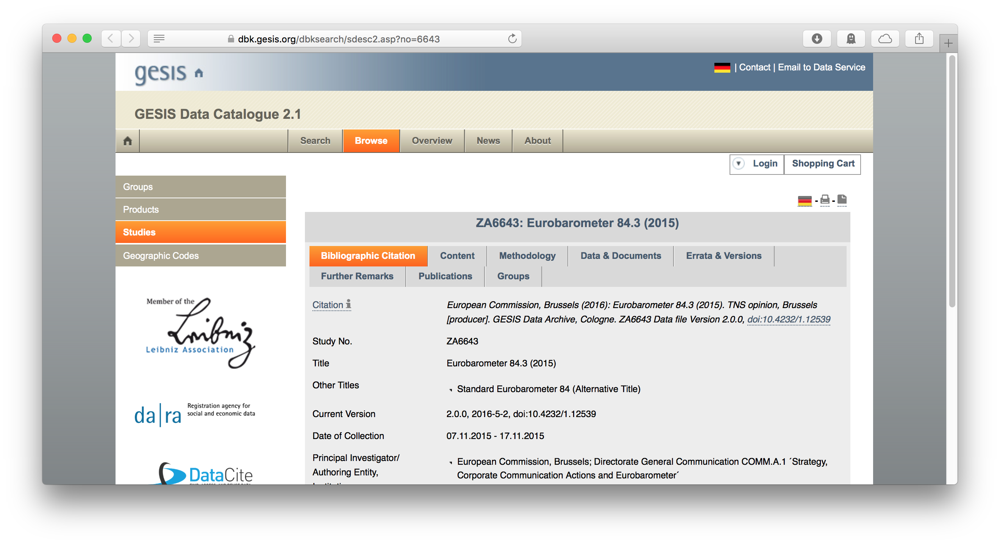

## Data Access with Login: `gesis`

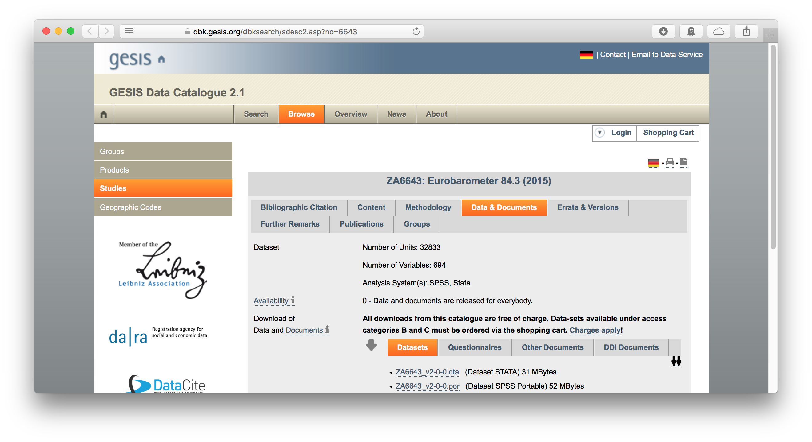

## Data Access with Login: `gesis`

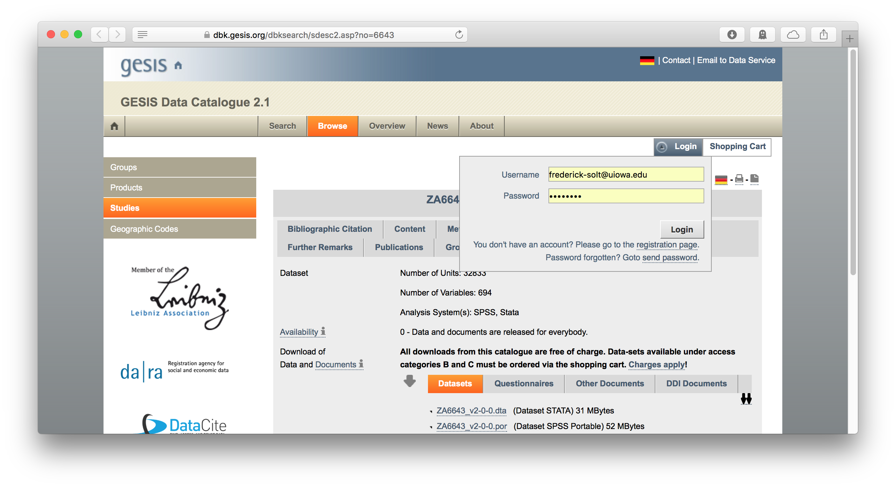

## Data Access with Login: `gesis`

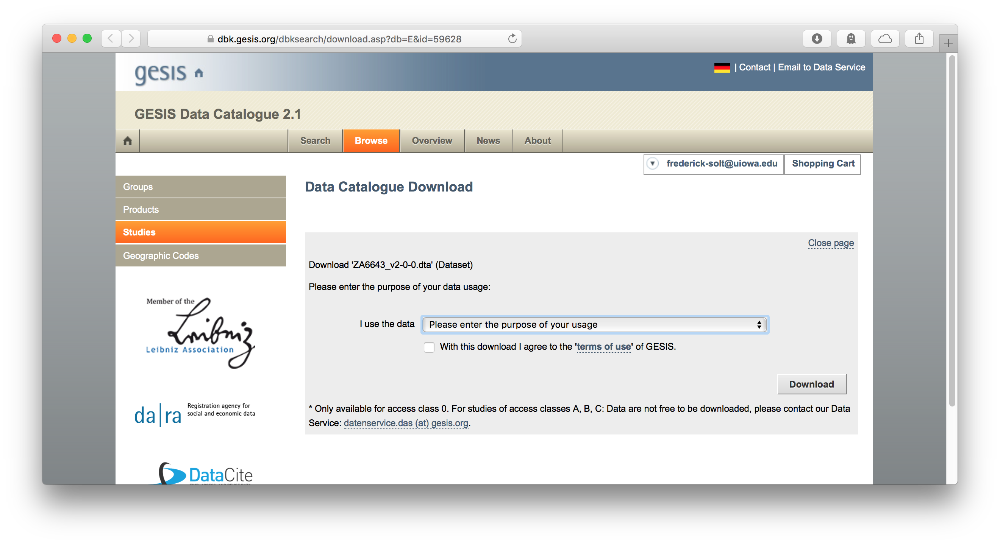

## Data Access with Login: `gesis`

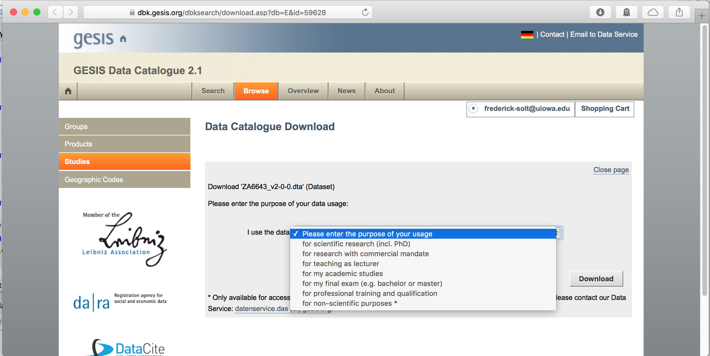

## Data Access with Login: `gesis`

<!-- eval=FALSE with faked output to avoid using real password -->
```{r, eval=FALSE}
library(gesis)
fs <- login(username = "frederick-solt@uiowa.edu", 
            password = "not_my_real_password!") 
download_dataset(s = fs, 
                 doi = "6643", 
                 path = "cmcr04_files",
                 purpose = 1) # "1. for scientific research"
```

<pre >## Downloading DOI: 6643</pre>

```{r, echo=TRUE}
list.files(path = "cmcr04_files", pattern="ZA.*")
```

## Data Access with Login: `gesis`

Note that you should actually save your username and password in your [.Rprofile](http://www.statmethods.net/interface/customizing.html) as "gesis_user" and "gesis_pass" to keep your information private.

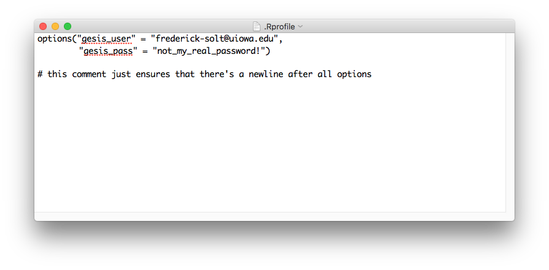

## Data Access with Login: `gesis`

Note that you should actually save your username and password in your [.Rprofile](http://www.statmethods.net/interface/customizing.html) as "gesis_user" and "gesis_pass" to keep your information private.

```{r, eval=FALSE}
library(gesis)
fs <- login(getOption("gesis_user"), getOption("gesis_pass"))
download_dataset(s = fs, 
                 doi = "6643", 
                 path = "cmcr04_files",
                 purpose = 1) # "1. for scientific research"
```

<pre >## Downloading DOI: 6643</pre>

## Data Access: A Few More Packages

>- [`pewdata`: Reproducible Retrieval of Pew Research Center Datasets](https://cran.r-project.org/package=pewdata).

>- [`icpsrdata`: Reproducible Data Retrieval from the ICPSR Archive](https://cran.r-project.org/package=icpsrdata).

>- [`CANSIM2R`: Directly Extracts Complete CANSIM Data Tables](https://cran.r-project.org/package=CANSIM2R). "Extract CANSIM (Statistics Canada) tables and transform them into readily usable data in panel (wide) format." Use `CANSIM2R:::downloadCANSIM()` to just get the data.

>- [`pxweb`: R Interface to the PX-Web/PC-Axis API](https://cran.r-project.org/package=pxweb).
"The PX-Web/PC-Axis API is used by organizations such as Statistics Sweden and Statistics Finland to disseminate data."

>- See Joe Rickart's [R Packages for Data Access](http://blog.revolutionanalytics.com/2016/08/r-packages-data-access.html) for some more, and there's many more out there.

## Transforming Data
```{r, include=FALSE}
suppressPackageStartupMessages(library(dplyr))
```

>- `filter()`

>- `arrange()`

>- `select()`

>- `mutate()` / `transmute()`

>- `group_by()` + `summarize()`

## Transforming Data
```{r, include=FALSE}
suppressPackageStartupMessages(library(dplyr))
```

- `filter()`

- `arrange()`

- `select()`

- `mutate()` / `transmute()`

- `group_by()` + `summarize()`

>- An indispensible resource: RStudio's [Cheatsheet to Data Wrangling](https://www.rstudio.com/wp-content/uploads/2015/02/data-wrangling-cheatsheet.pdf)

## Tidying Data

Remember that Australian Excel file we grabbed with the static link?

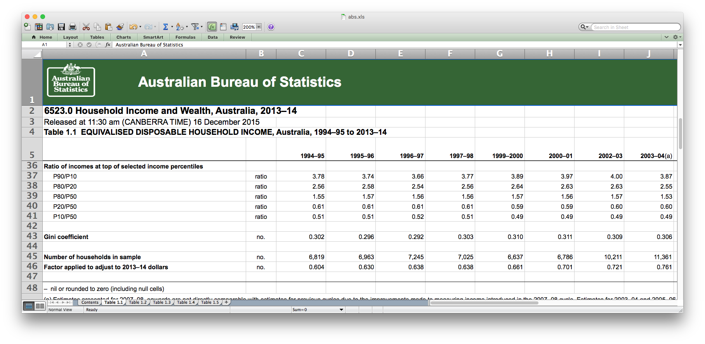

It's got a problem:

## Tidying Data

It isn't tidy.

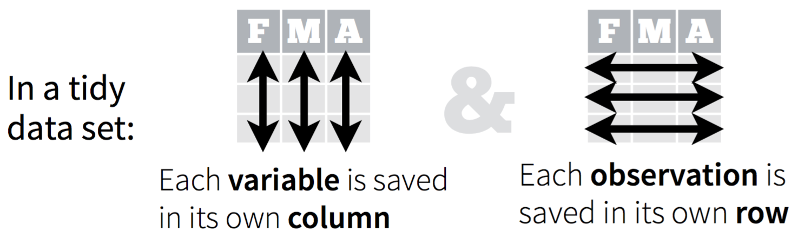

This means that it won't play well with others.

## Tidying Data

Remember that Australian Excel file we grabbed with the static link?


It won't play well with others, so we'll have to tidy it before use.


## Tidying Data

<!-- Output is noisy, so eval=FALSE for show followed by echo=FALSE, include=FALSE -->

```{r, eval=FALSE}
library(rio)
ineq <- import("cmcr04_files/abs.xls", sheet = "Table 1.1", skip = 4) 
```

```{r, echo=FALSE, include=FALSE}
library(rio)
ineq <- import("cmcr04_files/abs.xls", sheet = "Table 1.1", skip = 4)
```

## Tidying Data

```{r, eval=FALSE}
library(rio)
ineq <- import("cmcr04_files/abs.xls", sheet = "Table 1.1", skip = 4)
View(ineq)
```

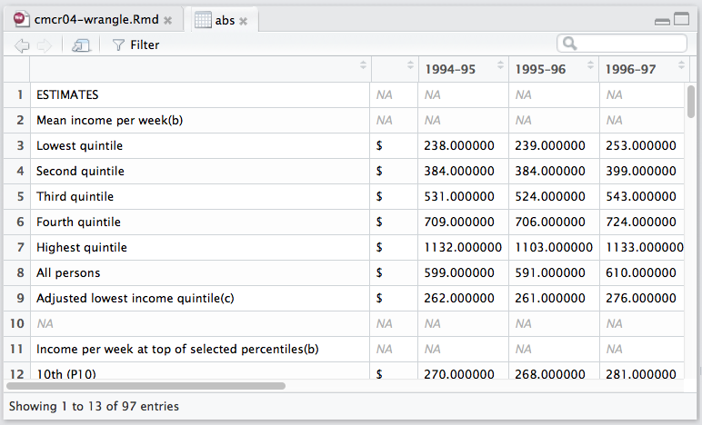

## Tidying Data

First step: give names to those first two columns!
```{r}
names(ineq)
```
```{r}
names(ineq)[1:2] <- c("var", "unit")
names(ineq)
```

## Tidying Data

Second step: gather the (Gini) data
```{r}
library(tidyr)
gathered <- ineq %>% 
    filter(var=="Gini coefficient") %>% 
    mutate(var = ifelse(unit=="RSE(%)", "gini_rse", "gini")) %>% 
    select(-unit) %>% 
    gather(key = year, value = val, -var)
```

## Tidying Data

Second step: gather the (Gini) data

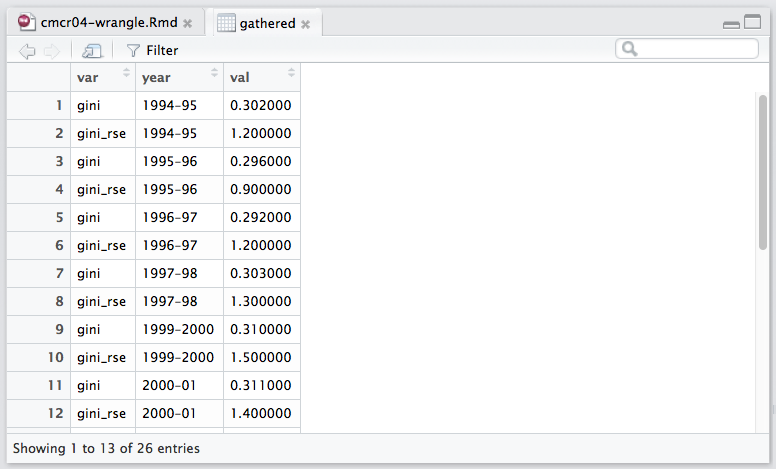

## Tidying Data

Third step: spread the data again

```{r}
spreaded <- gathered %>% 
    spread(key = var, value = val)
```

## Tidying Data

Third step: spread the data again

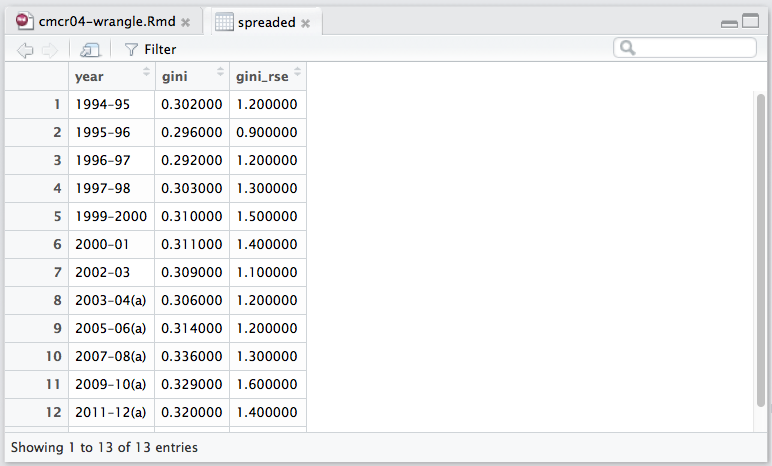

It's tidy now!

## Tidying Data

It's tidy, but its still not clean.  Fourth step: clean up

```{r}
library(stringr) # more on stringr next week!
ineq_tidy <- spreaded %>% 
    transmute(country = "Australia",
              year = str_replace(year, "\\(a\\)", ""),
              year = ifelse(str_extract(year, "\\d{2}$") %>%
                                as.numeric() > 50,
                            str_extract(year, "\\d{2}$") %>%
                                as.numeric() + 1900,
                            str_extract(year, "\\d{2}$") %>% 
                                as.numeric() + 2000),
              gini = as.numeric(gini),
              gini_se = as.numeric(gini_rse)/100 * gini)
```

## Tidying Data

It's tidy, but its still not clean.  Fourth step: clean up

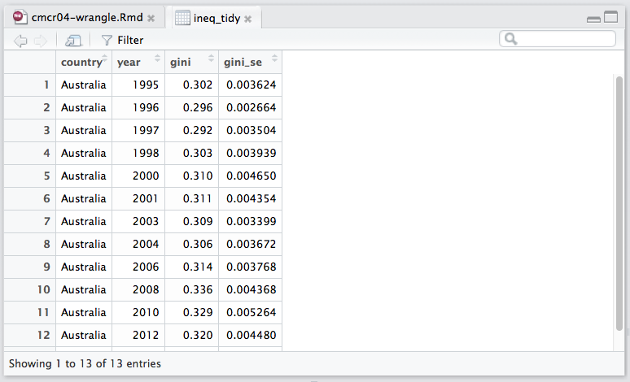
