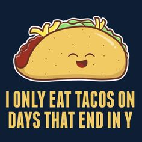
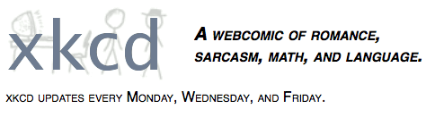
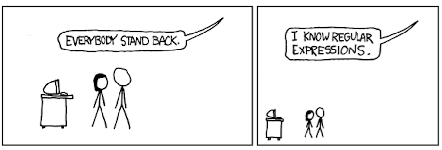
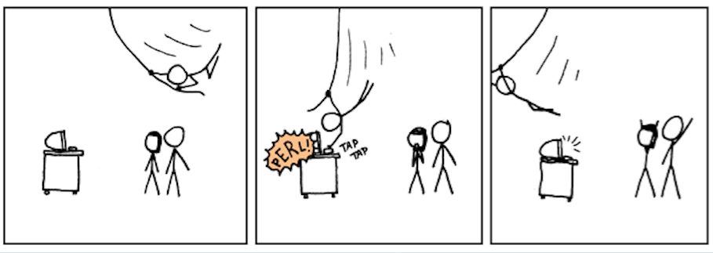

```{r setup, include=FALSE}
options(width=60)
```

Wrangling Data II: <br/> Working with Text
===


## Strings

Strings are simply data in the form of characters rather than numbers.  Still, they can be a bit trickier to deal with.  The `stringr` package simplifies the process, and all of its commands begin with `str_` to make them a bit easier to remember.

```{r, message=FALSE}
library(tidyverse)  # loads ggplot2, tibble, tidyr, readr,
                    # purrr, and dplyr
library(stringr)
```


## String Basics

`str_c()` combines two or more strings. Use the `sep` argument to define how the combined strings will be separated.

```{r}
days <- c("Sunday", "Monday", "Tuesday", "Wednesday",
          "Thursday", "Friday", "Saturday")
ordinals <- c("1st", "2nd", "3rd", "4th", "5th", "6th", "7th")

str_c(days, ", January ", ordinals, ", 2017")
```


## String Basics

`str_c()` combines two or more strings. Use the `sep` argument to define how the combined strings will be separated.

Use the `collapse` argument to combine the elements of a vector into a single string.

```{r}
str_c(days, collapse = "|")
```


## String Basics                                                            

`str_sub()` subsets a string: you tell it where to start and stop.

```{r}
str_sub(days, start = 1, end = 1)
```


## String Basics                                                            

`str_sub()` subsets a string: you tell it where to start and stop.  Use negative numbers to count from the end of the string.



```{r}
str_sub(days, start = -1, end = -1) 
# Oh, good!
```


## String Basics

- `str_to_lower()`, `str_to_upper()`, and `str_to_title()`

>- `str_trim()` and `str_pad()`

>- `str_length()`

## Regular Expressions

Regular expressions allow you to do some really superhuman things . . . 

## Regular Expressions

Regular expressions allow you to do some really superhuman things . . . 



## Regular Expressions

Regular expressions allow you to do some really superhuman things . . . 


## Regular Expressions

Regular expressions allow you to do some really superhuman things . . . 



## Regular Expressions

Regular expressions allow you to do some really superhuman things . . . 



>- Let's get _you_ this new, superhuman skill!

## Using Regular Expressions in R

- `str_detect()`: Does the regex pattern appear?

>- `str_extract()` and `str_extract_all()`: Get the pattern

>- `str_replace()` and `str_replace_all()`: Swap out the pattern

>- `tidyr::separate()`: Break up the variable at the pattern


## Regular Expressions

- Every character matches itself

## Regular Expressions

- Every character matches itself

```{r}
str_detect(days, "T")
```

## Regular Expressions

- Every character matches itself

```{r}
str_detect(days, "T") %>% which()
```

## Regular Expressions: Basics

- Every character matches itself

```{r}
str_detect(days, "T") %>% which()
```

```{r}
str_detect(days, "Th") %>% which()
```

## Regular Expressions: Basics

- `.` : _Any_ character (including spaces, etc.)

```{r}
str_extract(days, ".")
```

## Regular Expressions: Basics

- `.` :  _Any_ character (including spaces, etc.)

```{r}
str_extract_all(days, ".")
```

## Regular Expressions: Repetition

- `*` and `+` :  _Greedy_ repetition (0 or more and 1 or more)

```{r}
str_extract(days, ".*")
```


## Regular Expressions: Repetition

- {2} : _Fixed_ repetition, in this case 2 times

```{r}
str_extract(days, ".{2}")
```

## Regular Expressions: Repetition

- {7,} : _At least_ repetition; here, at least 7 times

```{r}
str_extract(days, ".{7,}")
```

## Regular Expressions: Repetition

- {7,} : _At least_ repetition; here, at least 7 times

```{r}
str_extract(days, ".{7,}")

str_extract(days, ".{7,}") %>% str_length()
```

## Regular Expressions: Repetition

- {7,8} : _Between_ repetition; here, at least 7 times but not more than 8

```{r}
str_extract(days, ".{7,8}")

str_extract(days, ".{7,8}") %>% str_length()
```

## Regular Expressions: Optional Matches

- `?` :  _Greedy_ optional match (match 0 or 1 times, prefer 1)

```{r}
str_extract(days, ".at")

str_extract(days, ".at?")
```

## Regular Expressions: Optional Matches

- `??` :  _Lazy_ optional match (match 0 or 1 times, prefer 0)

```{r}
str_extract_all(days, ".at?") %>% unlist() # unlist() just to fit slide
str_extract_all(days, ".at??") %>% unlist() 
```

## Regular Expressions: Repetition

- `*?` and `+?` :  _Lazy_ repetition (0 or more and 1 or more)

```{r}
str_extract(days, "a.+")
str_extract(days, "a.+?")
```


## Regular Expressions: Anchors

- `^` and `$` :  The beginning and end of the string

```{r}
str_extract(days, ".a.")
str_extract(days, "^.a.")
str_extract(days, ".a.$")
```

## Regular Expressions: Character Classes

- Okay, so I'm a fifth-level half-elven ranger, and

## Regular Expressions: Character Classes

- ~~Okay, so I'm a fifth-level half-elven ranger, and~~

Sorry

## Regular Expressions: Character Classes

- Make your own wildcard with `[` and `]`!

```{r}
str_extract(days, ".[aeiou]") # any character & then a lowercase vowel
```

## Regular Expressions: Character Classes

- Within a character class, `^` means _not_

```{r}
str_extract(days, ".[^aeiou]") # any character & then one NOT a lc vowel
```

## Regular Expressions: Capture Groups

- Parentheses remember the match within them to use later

```{r}
str_replace(days, "([aeiou])", "\\1\\1\\1") 
```

- What will this do?

```{r, eval=FALSE}
str_replace(days, "([aeiou])(.*)([aeiou])", "\\3\\2\\1")
```

## Regular Expressions: Capture Groups

- Parentheses remember the match within them to use later

```{r}
str_replace(days, "([aeiou])", "\\1\\1\\1") 
```

- What will this do?

```{r}
str_replace(days, "([aeiou])(.*)([aeiou])", "\\3\\2\\1")
```


## Regular Expressions: Capture Groups

- With _greedy_ repetition, we match first and _last_ vowels

```{r}
str_replace(days, "([aeiou])(.*)([aeiou])", "\\3\\2\\1") 
```

- With _lazy_ repetition, we matches first and _second_ vowels

```{r}
str_replace(days, "([aeiou])(.*?)([aeiou])", "\\3\\2\\1")
```

## Regular Expressions: Capture Groups

- Capture groups can be nested: the count goes with the opening paren

```{r}
monster_truck_days <- str_replace(days, "(.*(day))", "\\1\\1\\1\\2\\2") 
monster_truck_days
```

## Regular Expressions: Capture Groups

- Capture groups also allow you to apply repetition, etc., to whole group

```{r}
str_detect(monster_truck_days, "(day){3}")
```

## Regular Expressions: An Example


## Regular Expressions: An Example

```{r}
weather <- readLines("cmcr05_files/jan_weather.txt")
weather
```

## Regular Expressions: An Example

```{r}
day_pattern <- str_c(days, collapse = "|")

weather_df <- weather %>% 
    data_frame(text = .,
               day_date = ifelse(str_detect(text, day_pattern),
                                 text,
                                 NA_character_)) %>% 
    filter(!(str_detect(text, "^\\s*$")))

weather_df
```

```{r}
weather_df <- weather_df %>% 
    zoo::na.locf() %>% 
    filter(text!=day_date) %>% 
    separate(day_date, into = c("day", "date"), sep = " ")
```

