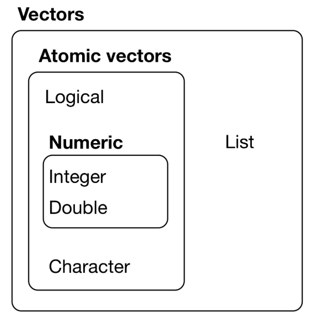

```{r setup, include=FALSE}
options(width=60)
```

Programming
===


## Functions

Functions are an easy way to make your code reusable.  If there's a task you often want to do, converting your code into a function is a very good idea:

1.  Compared to copying your code over and over, making the little needed changes each time, you'll be much less likely to introduce mistakes into your script.

2.  Your script will be easier to update: just make a change to your function, not all over your script in every place you do the task.

3.  Your script will be easier to read, because you can give your function a name that describes what it does.


## Parts of a Function {.build}

Functions have three parts:

1.  The body of code that you often want to use: this gets wrapped in braces; 

2.  The little bits that you'd change each time: these will become the *arguments*; and

3.  A name that describes what it does, therefore preferably a verb.

so:

```{r, eval=FALSE}
    name_part3 <- function(arguments_part2) {
        body_part1
    }
```

## Return Value

You want a function to do something and give it back to you: that's the return value.

- Return a value *explicitly* with `return()`

```{r, eval=FALSE}
    name_part3 <- function(arguments_part2) {
        body_part1
        return(whatever_output)
    }
```

## Return Value

You want a function to do something and give it back to you: that's the return value.

- Return a value *explicitly* with `return()`

- Or, if your function is called for a *side effect*, return the data with `invisible(df)` so that the pipe-chain can continue.

```{r, eval=FALSE}
    name_part3 <- function(df, arguments_part2) {
        body_part1
        invisible(df)
    }
```

# Iteration: it's all about `purrr::map()`, people

## Using `map()`

```{r}
library(tidyverse) # includes purrr
```

- The logic of `map()` is that you pass it a *vector*, and it will perform the function you specify on every element of the vector

## Vectors, Briefly

<div class="columns-2">


>- Atomic vectors have elements of a single type

>- Elements of *lists* can be of different types

>- A `data_frame` is a list of variables 
    + Each variable is a named atomic vector of the same length

>- `NULL` is a vector of length 0 
</div>

## Variants of `map()`

`map()` takes one vector as input and returns a list

<div class="columns-2">

**Output Variants**

>- `map_chr()`, `map_int()`, etc. return an atomic vector

>- `walk()` returns the input vector invisibly; use it for side effects

**Input Variants**

>- `map2()` takes *two* vectors; they are applied in parallel

>- `pmap()` takes a *list* of vectors to apply in parallel

</div>

>- All *combinations* exist: `map2_chr()`, `pwalk()`, etc.

>- Especially handy: `map_df()`

## Example: A Function

```{r}
library(stringr)

get_exercises <- function(ch) {
  ex <- data_frame(line = readLines(ch),
             header = str_extract(line, "^#+ .*")) %>%
    fill(header) %>%
    filter(str_detect(header, "Exercises"))
  return(ex$line)
}
```

## Example: A Function

```{r}
ch19 <- get_exercises(ch = "../../r4ds/functions.Rmd")

head(ch19, n = 9)
```

## Example: A Function
```{r}
ch19 <- get_exercises(ch = "../../r4ds/functions.Rmd")
ch21 <- get_exercises(ch = "../../r4ds/iteration.Rmd")

front_matter <- c("---",
               "title: 'R for Data Science: Exercises for Section Program'",
               'author: ["Garrett Grolemund", "Hadley Wickham"]',
               "output: html_document",
               "---", "")

c(front_matter, ch19, ch21) %>% 
    writeLines("cmcr_r4ds_exercises_program.Rmd")
```

## Example: Iteration with `map()`

```{r}
dir <- "../../r4ds/"
chapters <- c("functions.Rmd",
              "iteration.Rmd")

str_c(dir, chapters) %>%
    map(function(x) get_exercises(x)) %>% # an 'anonymous function'
    unlist() %>%
    c(front_matter, .) %>% 
    writeLines("cmcr_r4ds_exercises_program.Rmd")
```

## Example: Iteration with `map()`

```{r}
dir <- "../../r4ds/"
chapters <- c("functions.Rmd",
              "iteration.Rmd")

str_c(dir, chapters) %>%
    map(~ get_exercises(.)) %>% # a 'one-sided formula'
    unlist() %>%
    c(front_matter, .) %>% 
    writeLines("cmcr_r4ds_exercises_program.Rmd")
```

