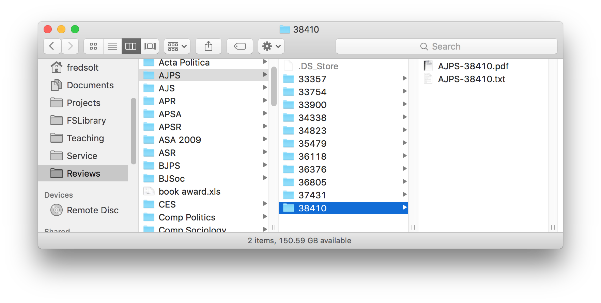
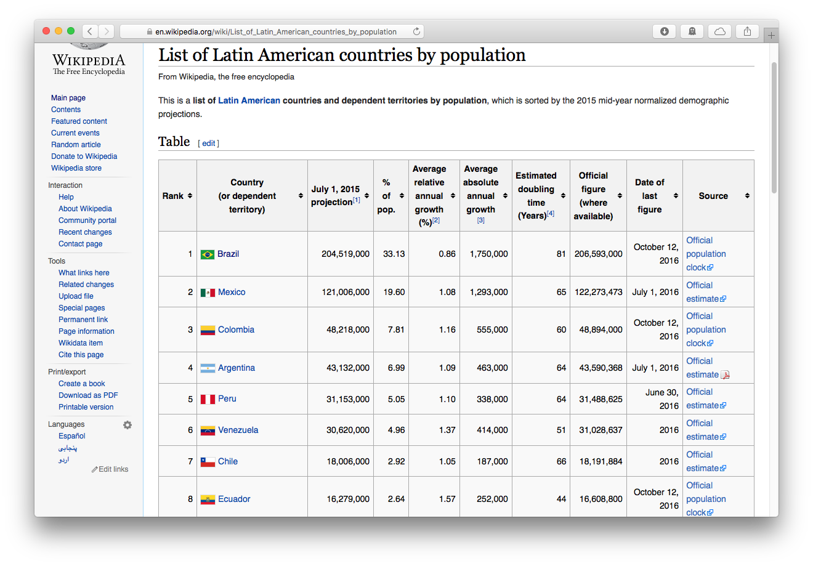
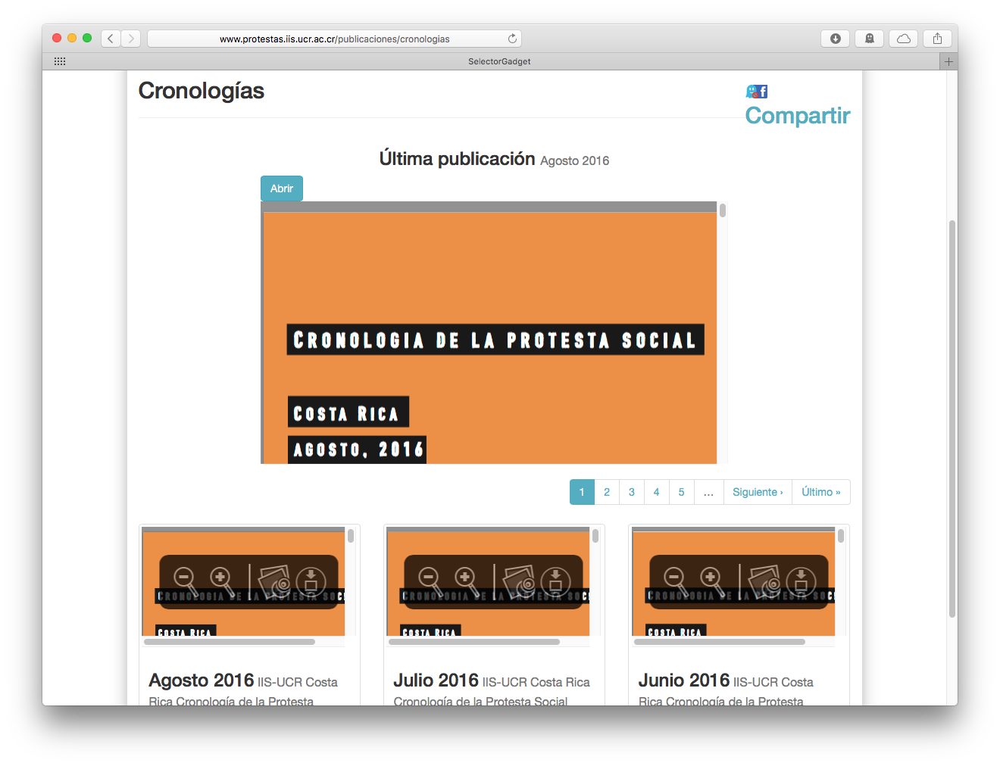
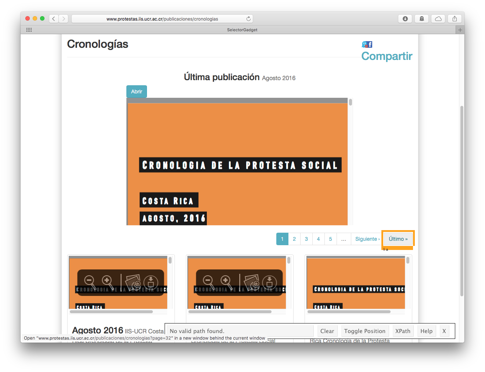
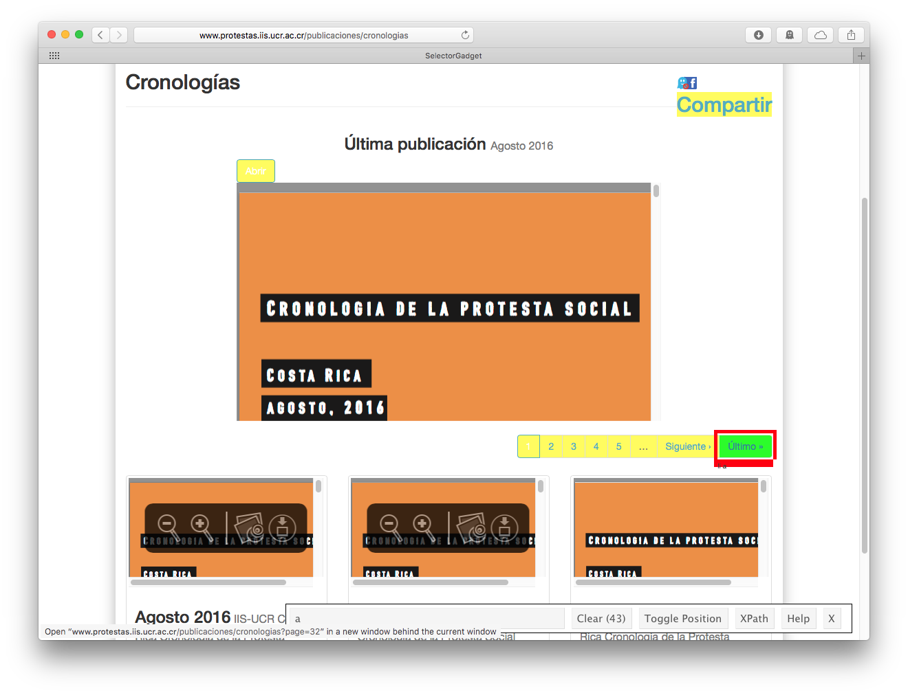
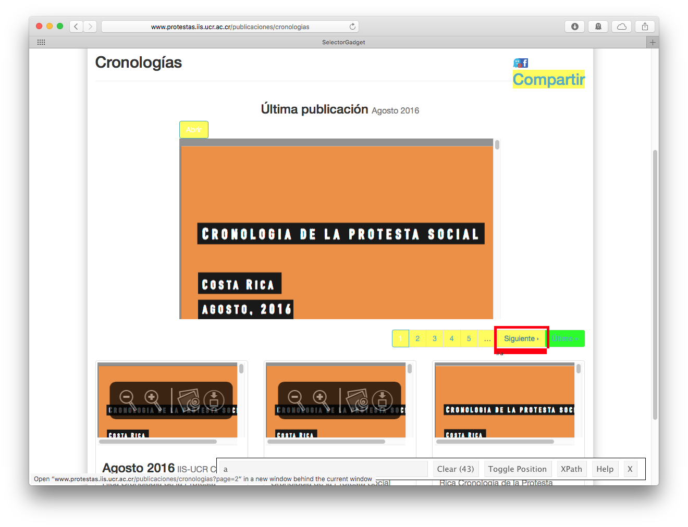
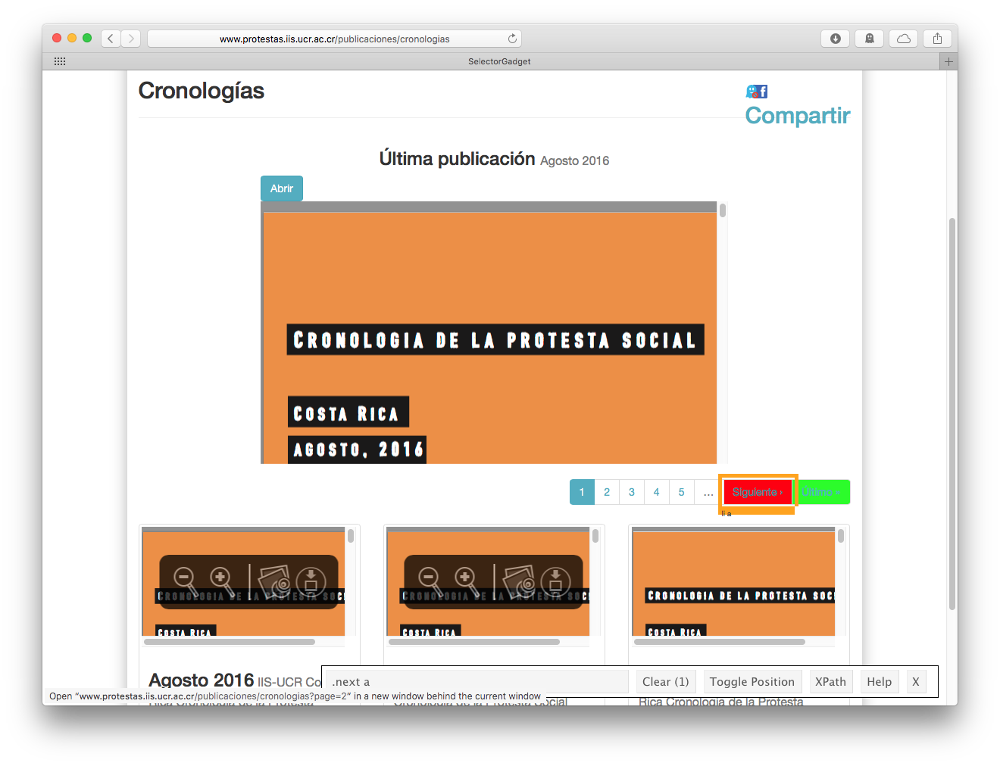
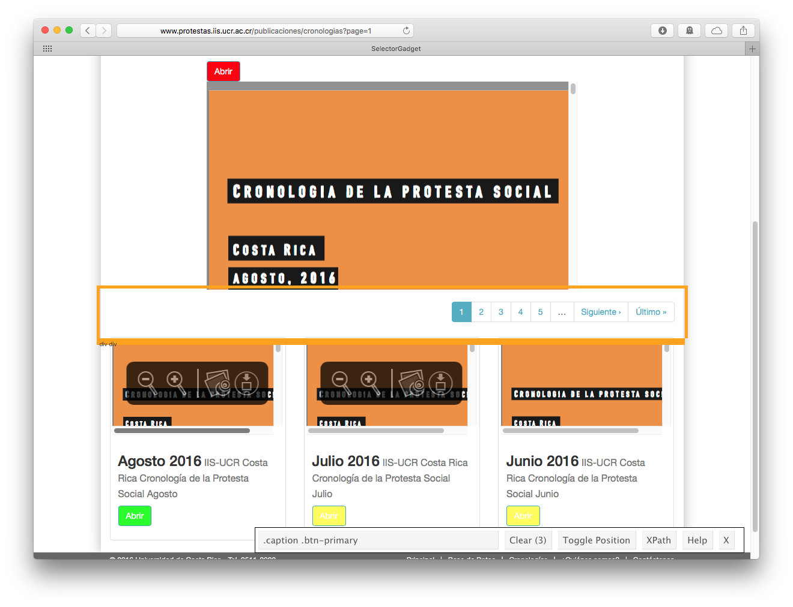

```{r setup, include=FALSE}
options(width=60)
```

Scraping and<br/> Managing Data
===

# Managing Data

## Filenames

Take Jenny Bryan's advice to make sure your filenames:

0. are machine readable
    - and so are easy to search, filter, regex 

0. are human readable
    - and so are easy to figure out

0. play well with default ordering
    - put something numeric first

    - use the ISO 8601 standard for dates

    - left pad other numbers with zeros
    
>- BUT: leave the names of stuff you download alone

## Directory Structure

0. All files for a project should reside in a single directory (folder)

0. All project folders should be in a single directory, too (e.g., "projects")

0. This goes for everything else, btw
    - One for all teaching, with one folder for each class
        - prefixed with course number: "1400_intro-to-comparative"
        - with subdirs for each semester, slides, lectures, etc.

## Directory Structure

0. All files for a project should reside in a single directory (folder)

0. All project folders should be in a single directory, too (e.g., "projects")

0. This goes for everything else, btw
    - One for all reviewing
        - with a folder for each journal, and one for each ms 
        <p style="text-align:center"></p>

## Directory Structure

0. All files for a project should reside in a single directory (folder)

0. All project folders should be in a single directory, too (e.g., "projects")

0. This goes for everything else, btw
    - One for all service
        - with a folder for each committee
    
    - and so on . . .

## Scraping with `rvest`

Set up

```{r, message=FALSE}
library(tidyverse)
library(rvest)
library(stringr)
library(lubridate)
```

# Scraping Tables

## Scraping Tables
Simple, three-step process:

1. read the html of the page with the table using `read_html()`

2. extract the table using `html_table()`

3. wrangle as needed


## Step 1: Read the Webpage

<p style="text-align:center"></p>

```{r, eval=FALSE}
page <- read_html("http://en.wikipedia.org/wiki/
                  List_of_Latin_American_countries_by_population")
```

```{r, include=FALSE}
page <- read_html("http://en.wikipedia.org/wiki/List_of_Latin_American_countries_by_population")
```


## Step 2: Extract the Table

```{r}
latam_pop <- page %>% 
    html_table(fill=TRUE) %>% # generates a list
    first() %>%               # get first element of list
    as_tibble()           # make it a tibble (data_frame)
    
latam_pop
```

## Step 3: Wrangle as Needed

Variable names are probably bad . . .

```{r}
names(latam_pop)
```

## Step 3: Wrangle as Needed

One solution: `janitor::clean_names()`

```{r, message=FALSE}
if (!require("janitor")) install.packages("janitor")
latam_pop <- latam_pop %>% janitor::clean_names()

names(latam_pop)
```

## Step 3: Wrangle as Needed

Another:

```{r}
names(latam_pop) <- c("rank", "country", "est_pop_2015",
                      "percent_latam", "annual_growth_rate",
                      "annual_growth", "doubling_time",
                      "official_pop", "date_pop",
                      "source")
```

## Step 3: Wrangle as Needed

```{r}
latam_pop$country[17:27]
```

## Step 3: Wrangle as Needed

```{r}
latam_pop <- latam_pop %>% 
    mutate(country = str_replace_all(country, "\\[.*\\]|\\(.*\\)", "") %>% 
               str_trim()) %>% 
    filter(country!="Total")

latam_pop$country[17:nrow(latam_pop)]
```

## Step 3: Wrangle as Needed

Are numbers encoded as strings?

```{r}
latam_pop$official_pop
str(latam_pop$official_pop)
```

## Step 3: Wrangle as Needed

```{r}
latam_pop <- latam_pop %>% 
    mutate(official_pop = str_replace_all(official_pop, ",", "") %>%
               as.numeric())

latam_pop$official_pop
str(latam_pop$official_pop)
```

## Step 3: Wrangle as Needed

```{r}
latam_pop$date_pop
```

## Step 3: Wrangle as Needed

Get dates into POSIXct format

```{r}
latam_pop$date_pop
```

## Step 3: Wrangle as Needed

Get dates into POSIXct format
```{r, warning=FALSE}
latam_pop <- latam_pop %>% 
    mutate(date_pop2 = if_else(str_detect(date_pop, "^\\d"),
                              parse_date_time(date_pop, "y"),
                              parse_date_time(date_pop, "m d, y")))

latam_pop$date_pop2
```


# Scraping Files

## Scraping Files
Pretty common to want to get all of the files linked from a website

<p style="text-align:center"></p>

## Scraping Files: An Example

- We need to get all the reports, but only three are linked per page, and the links were not systematically generated

>- So we need to visit every page to get all the links

>- So we need to know the number of the *last* page

## Scraping Files: An Example

<p style="text-align:center"></p>

## Scraping Files: An Example

<p style="text-align:center"></p>

## Scraping Files: An Example

<p style="text-align:center"></p>

## Scraping Files: An Example

<p style="text-align:center"></p>

## Scraping Files: An Example

<p style="text-align:center"></p>

## Scraping Files: An Example

<p style="text-align:center"></p>

We want the node ".next a"!

## Scraping Files: An Example

```{r}
last_page <- read_html("http://www.protestas.iis.ucr.ac.cr/publicaciones/cronologias") %>% 
    html_nodes(".next a")

last_page
```

## Scraping Files: An Example

```{r}
last_page <- read_html("http://www.protestas.iis.ucr.ac.cr/publicaciones/cronologias") %>% 
    html_nodes(".next a") %>%
    html_attr("href")

last_page
```

## Scraping Files: An Example

```{r}
last_page <- read_html("http://www.protestas.iis.ucr.ac.cr/publicaciones/cronologias") %>% 
    html_nodes(".next a") %>%
    html_attr("href") %>% 
    str_extract("\\d+$") %>% 
    as.numeric()

last_page
```

Yay!

## Scraping Files: An Example

Now we need to build list of all pages of reports

```{r}
all_pages <- str_c("http://www.protestas.iis.ucr.ac.cr/publicaciones/cronologias?page=", 1:last_page)

all_pages
```

## Scraping Files: An Example

Then get the (arbitrary) numbers that identify reports on each page

## Scraping Files: An Example

<p style="text-align:center"></p>


## Scraping Files: An Example

Then get the (arbitrary) numbers that identify reports on each page

```{r}
report_numbers <- map(all_pages, function(page) {
    read_html(page) %>%
        html_nodes(".caption .btn-primary") %>%
        html_attr("href")}) %>%
    unlist() %>% 
    str_extract("\\d+")
```

## Scraping Files: An Example

Then get report names, formatted to year_month 

```{r}
mes <- data_frame(
    mes = c("Enero", "Febrero", "Marzo", "Abril",
         "Mayo", "Junio", "Julio", "Agosto",
         "Septiembre", "Octubre", "Noviembre", "Diciembre"),
    no = sprintf("%02d", 1:12))
```

## Scraping Files: An Example

Then get report names, formatted to year_month

```{r}
report_names <- map(all_pages, function(page) {
    read_html(page) %>%
        html_nodes(".caption h3") %>%
        str_extract("(?<=>)[^<]*")}) %>%
    unlist() %>% 
    as_data_frame() %>% 
    separate(value, c("mes", "year"), " ") %>% 
    left_join(mes, by = "mes") %>% 
    unite(name, year, no) %>% 
    select(name) %>% 
    unlist()
```

## Scraping Files: An Example
Then make a `files` directory, if one doesn't already exist

```{r}
dir.create("data-raw/files", showWarnings = FALSE, recursive = TRUE) 
```

## Scraping Files: An Example

And finally, download all reports as PDF files

```{r, eval=FALSE}
walk2(report_numbers, report_names, function(number, name) {
    # if file doesn't exist
    if (!file.exists(str_c("data-raw/files/", name, ".pdf"))) { 
        # get the link to it
        doc <- str_c("http://www.protestas.iis.ucr.ac.cr/publicaciones/", number) %>%
            read_html() %>% 
            html_node(":nth-child(6) .col-md-12") %>% 
            str_extract('\\/system[^\\"]+') %>% 
            str_c("http://www.protestas.iis.ucr.ac.cr", .) 
        # and download
        download.file(doc, destfile = str_c("data-raw/files/", name, ".pdf")) 
    }
})
```
