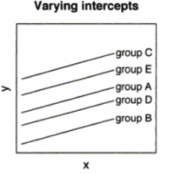
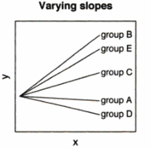
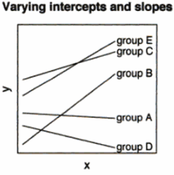
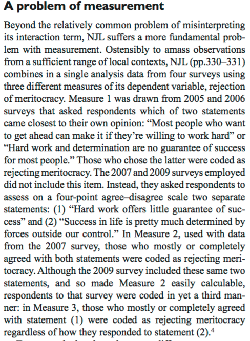
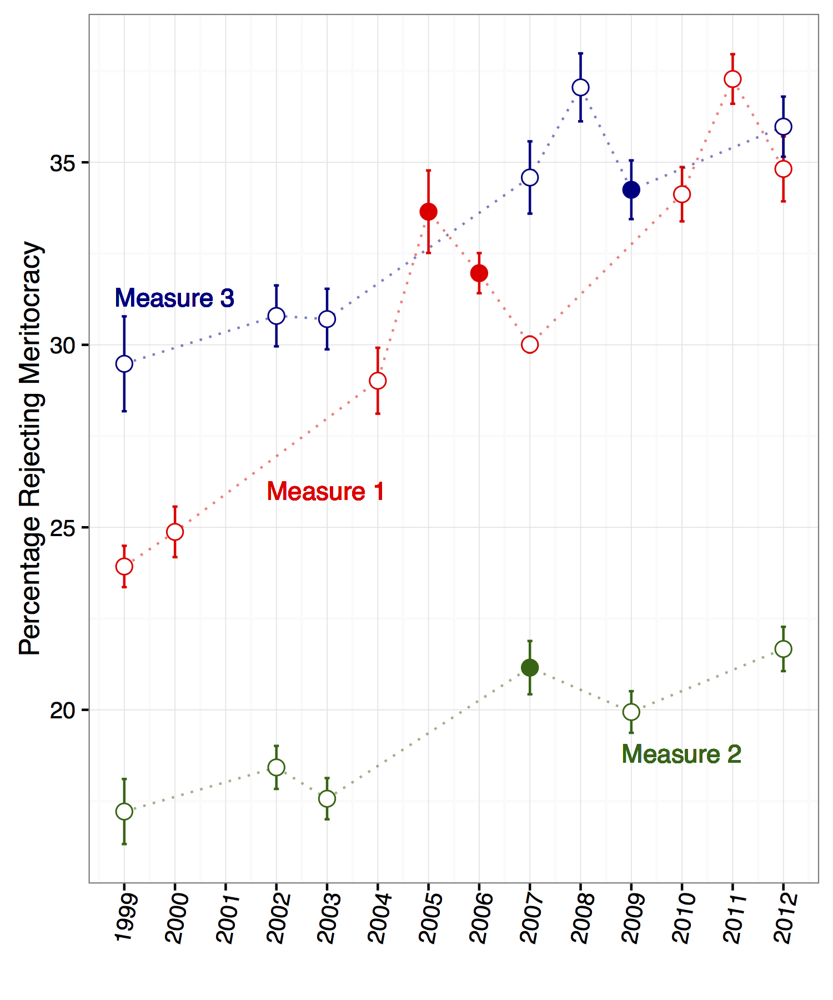
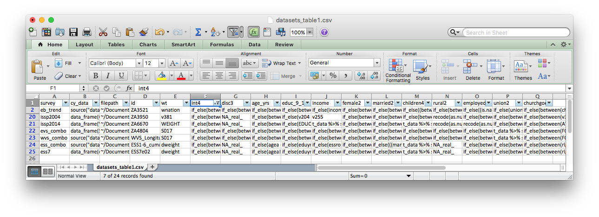

```{r setup, include=FALSE}
options(width=60)
```

Multilevel Modeling with<br/> Multiple Surveys
===

## Multilevel Modeling

- Deals with lack of independence among groups of observations
- In comparative research, many outcomes we care about are 'nested' within country contexts:

    + individual attitudes, 
    + party positions, 
    + policy adoptions, etc.
    
- Attitudes of German citizens are probably more similar to each other on average than to those of French people: if this is true, it violates OLS assumption of uncorrelated errors

- [Steenbergen and Jones' 2002 _AJPS_ article](http://www.jstor.org/stable/3088424) popularized MLM in political science as a solution to this issue

## Multilevel Modeling

Countries may exhibit:

- differences in their average levels of `y`:   
the intercepts vary

<p style="text-align:center"></p>

[Gelman and Hill (2007), _Data Analysis Using Regression and Multilevel/Hierarchical Models_](https://books.google.com/books?id=lV3DIdV0F9AC&printsec=frontcover&dq=gelman+hill&hl=en&sa=X&ved=0ahUKEwiE_pPKoYrQAhVj9YMKHemEBUoQuwUIITAA#v=onepage&q&f=false), p238.

## Multilevel Modeling

Countries may exhibit:

- differences in the observed relationship between `x` and `y`:
the slopes vary

<p style="text-align:center"></p>

[Gelman and Hill (2007), _Data Analysis Using Regression and Multilevel/Hierarchical Models_](https://books.google.com/books?id=lV3DIdV0F9AC&printsec=frontcover&dq=gelman+hill&hl=en&sa=X&ved=0ahUKEwiE_pPKoYrQAhVj9YMKHemEBUoQuwUIITAA#v=onepage&q&f=false), p238.

## Multilevel Modeling

Countries may exhibit:

- both!

<p style="text-align:center"></p>

[Gelman and Hill (2007), _Data Analysis Using Regression and Multilevel/Hierarchical Models_](https://books.google.com/books?id=lV3DIdV0F9AC&printsec=frontcover&dq=gelman+hill&hl=en&sa=X&ved=0ahUKEwiE_pPKoYrQAhVj9YMKHemEBUoQuwUIITAA#v=onepage&q&f=false), p238.

- If we need to include varying intercepts (at least), we need a multilevel model

## Multilevel Modeling

Fortunately, both varying intercepts and varying slopes are straightforward to
model and estimate

```{r, eval=FALSE}
# estimate varying intercepts by country
m1 <- lmer(y ~ x + (1 | country)) 

# estimate varying slope for x by country, too
m2 <- lmer(y ~ x + (1 + x | country)) 
```


## Multilevel Modeling

More complex models:

```{r, eval=FALSE}
# three-level varying-intercepts model
m3 <- lmer(y ~ x + (1 | country_year) + (1 | country))
```

## Multilevel Modeling

More complex models:

```{r, eval=FALSE}
# three-level varying-intercepts model
m3 <- lmer(y ~ x + (1 | country_year) + (1 | country))
```

```{r, eval=FALSE}
# 'cross-classified' model (to also account for potential period effects)
m4 <- lmer(y ~ x + (1 + x | country_year) + (1 | country) + (1 | year))
```

## MLM with Multiple Surveys

>- MLM is _the_ most common approach in comparative political behavior/public opinion

>- But most of this work still only looks at a single cross-national survey

>- Pooling surveys allows you to take advantage of more data . . .

>- but also depends on strong data-wrangling skills

## MLM with Multiple Surveys

1. Identify surveys that include identical items for study variables

2. Standardize coding for all survey items

3. Combine surveys into a single dataset

4. Identify contextual data

5. Merge survey and contextual data

6. Multiply impute missing data

7. Estimate the model

8. Interpret the results

## MLM with Multiple Surveys

0. **Identify surveys that include identical items for study variables**

0. **Standardize coding of survey items for all individual-level variables**

0. **Combine surveys into a single dataset**

0. Identify contextual data

0. Merge survey and contextual data

0. Multiply impute missing data

0. Estimate the model

0. Interpret the results

## 1. Identify Surveys

- You can use MLM on multiple surveys *iff* those surveys have identical items for your study variables!

>- 'Identical' = Same number of response categories, question and response text sufficiently similar that they could be translated the same way

## 1. Identify Surveys
Okay:

ESS: How interested would you say you are in politics – are you... (1) very interested, (2) quite interested, (3) not very interested, (4) not at all interested

EB: To what extent would you say you are interested in politics?

ISSP Citizenship: How interested would you say you personally are in politics?


## 1. Identify Surveys
Not okay:
<p style="text-align:center"></p>

## 1. Identify Surveys
Not okay:
<p style="text-align:center"></p>

## 2. Standardize Coding
<p style="text-align:center"></p>

## 3. Combine Surveys

```{r, eval=FALSE}
ds1 <- read_csv("~/Documents/Projects/engagement/data-raw/datasets_table1.csv") 

l1_data_all <- mlm_setup(datasets_table = ds1,
                         dep_var = "int4",
                         chime = TRUE)
```


